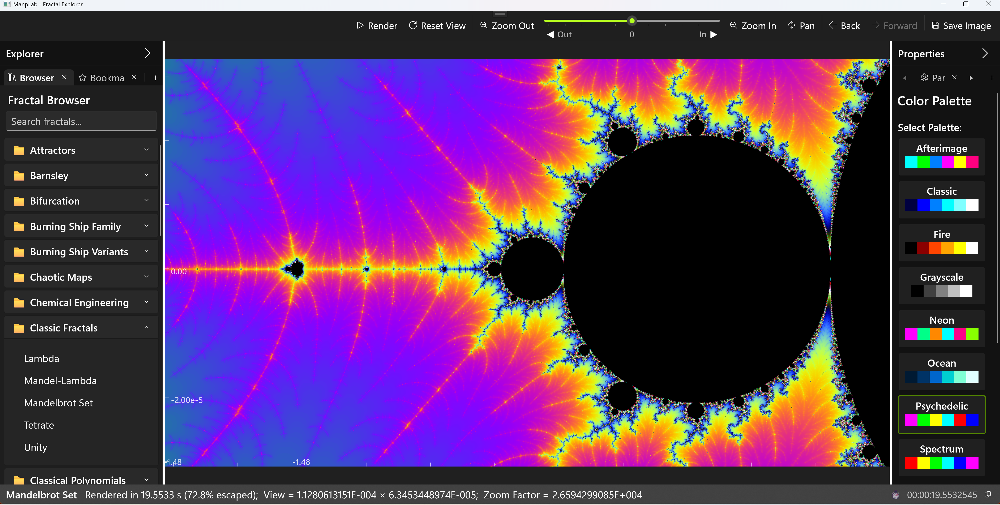

# ManpLab - Modern Fractal Explorer - Release 1.6.0 (Educational Fork)


**A modern WinUI 3 fractal explorer powered by Paul de Leeuw's production-grade rendering engine**

## 🚀 Overview

ManpLab combines a modern, intuitive WinUI 3 interface with Paul de Leeuw's exceptional fractal rendering engine - featuring perturbation theory, BLA acceleration, and arbitrary-precision arithmetic for extreme deep zoom capabilities (magnification > 10^100).

### Application Screenshot


*ManpLab Application - Dark theme*


### Key Features

- ✨ **Modern WinUI 3 Interface** - Clean, responsive UI with MVVM architecture
- 🎨 **328 Fractal Types** - Extended from Paul's 246 originals with 82 new implementations
- 🔬 **Deep Zoom Technology** - Perturbation theory with magnifications exceeding 10^100
- ⚡ **BLA Acceleration** - Series approximation for extreme performance at deep zoom levels
- 🧮 **Arbitrary Precision** - MPFR, QD, and DD libraries for numerical accuracy
- 🎬 **Animation Rendering** - Create MP4 videos with FFmpeg integration
- 🎯 **Flexible Parameter System** - Template-based parameters for 328 diverse fractal types with consistent UI
- 📚 **Fractal Browser** - Metadata, formulas, bookmarks, navigation history
- 🎨 **Theme System** - Light, Dark, Ocean Blue, and System themes
- 🖱️ **Interactive Exploration** - Mouse, keyboard, and touch navigation
- ⌨️ [Full Keyboard Shortcuts](KEYBOARD_SHORTCUTS.md)

### Architecture

```
┌─────────────────────────────────────────┐
│   ManpWinUI (WinUI 3 / .NET 10)        │
│   Modern UI, MVVM, Theme System         │
└──────────────────┬──────────────────────┘
                   │
┌──────────────────▼──────────────────────┐
│   Native C++ Fractal Engine             │
│   (Paul de Leeuw's Production Engine)   │
│   • Perturbation Theory                 │
│   • BLA Acceleration                    │
│   • Arbitrary Precision (MPFR/QD)       │
│   • 246 Original Fractal Types          │
│   • Extended to 328 Types in ManpLab    │
│   • Multithreaded Rendering             │
└─────────────────────────────────────────┘
```

This educational fork makes Paul DeLeeuw's well-engineered rendering technology accessible through a modern, user-friendly interface designed for students, educators, and researchers.

---

## 🎯 Flexible Parameter System

The **Flexible Parameter System (FPS)** enables ManpLab to handle 328 diverse fractal types with elegance:

1. **Uses templates** to accommodate the varying parameter requirements of many different fractal types
2. **Provides a consistent user interface** for all those types

### Key Benefits

- **🔧 Flexibility**: Each of the 328 fractals can have its own unique set of parameters
  - Newton fractals get polynomial degree controls
  - Mandelbrot gets bailout settings
  - Strange attractors get system parameters
  - And more...

- **🎨 Consistency**: Despite these differences, every fractal presents its parameters in the same organized, easy-to-use interface with:
  - Categorized parameter groups
  - Helpful tooltips and descriptions
  - Built-in validation and constraints
  - Unified editing experience


## 📷 Fractal Samples


*Mandelbrot Set rendered in the Spectrum palette*


*Classic Julia Set rendered in the Fire palette*


*Zoomed Tetrate rendered in the Psychedelic palette*


*2-Dimensional Hailstone Sequence with segments and point labels*


---

## Quick Start

### Pre-built Distributions

[](https://github.com/markhassellsmith/ManpLab/releases/latest)

**[Download Latest Release →](https://github.com/markhassellsmith/ManpLab/releases/latest)**

#### Portable ZIP (Recommended) ✅
- **No installation** - extract and run `ManpWinUI.exe`
- **No security warnings** - runs immediately
- **Self-contained** - includes all dependencies
- **Perfect for**: Educational use, quick testing, no admin rights needed

#### MSIX Package (Alternative)
- **Modern Windows app** - clean install/uninstall via Settings
- **⚠️ Shows security warning** - unsigned package (normal for open-source)
- See installation guide included in the download
- **Best for**: Users preferring managed apps with auto-update support

### Build from Source

```bash
git clone https://github.com/markhassellsmith/ManpLab.git
cd ManpLab
# Open ManpLab.sln in Visual Studio 2022 and build (F5)
```

All dependencies are included. The project builds without additional configuration.

**Requirements:**
- Windows 10 or 11 (x64)
- Visual Studio 2022 (Community Edition supported)
- .NET 10 SDK
- Git (for cloning)

---

## Educational Applications

ManpLab serves as a comprehensive platform for studying fractals, numerical methods, and computational mathematics:

### Mathematics
- Complex dynamics: 328 fractal types including Mandelbrot, Julia sets, Newton fractals
- Perturbation theory and BLA series approximation
- Arbitrary-precision arithmetic (MPFR, QD, DD libraries)
- Newton-Raphson root finding and analytical derivatives

### Computer Science
- WinUI 3 with MVVM pattern and C++/WinRT interop
- Large-scale C++ engine (156 source files, 6 CMake subprojects)
- Multithreaded rendering with progressive cancellation
- Template metaprogramming and cache optimization

### Physics & Engineering
- **Electrical:** Chua's circuit, fractal antennas, chaos-based encryption
- **Mechanical:** Turbulent flow, nonlinear oscillators, fracture mechanics
- **General:** Strange attractors (Lorenz, Rössler, Hénon), bifurcation analysis, Lyapunov exponents

---

## Technical Features

### Native C++ Rendering Engine
- **Deep Zoom:** Perturbation theory, BLA series expansion, arbitrary precision (MPFR), FloatExp extended exponent range
- **Rendering:** Multiple modes (escape-time, slope/derivative, distance estimation), orbit traps, biomorph coloring, 24-bit true color, bump mapping
- **Performance:** Multithreaded (all CPU cores), boundary tracing, progressive rendering, dynamic task distribution
- **Formula System:** Custom scripting language, VM bytecode execution, 100+ functions, Fractint compatibility

### WinUI 3 Interface
- MVVM architecture with data binding
- Theme support (Light, Dark, Ocean Blue, System)
- Fractal metadata browser with favorites
- Animation timeline editor

---

## Fractal Categories (41 Categories)

**Classic Fractals (20+):** Mandelbrot variants, Julia sets, Burning Ship, Newton fractals, Magnet fractals

**Advanced Variants (40+):** MandelDerivatives, Mandelbar/Tricorn, Spider, Thorn, Tetration, Power Towers

**Scientific Systems (30+):** Strange attractors (Lorenz, Rössler, Hénon, Pickover, Chua), bifurcation diagrams, Lyapunov fractals

**Hailstone Sequences:** 2D integer lattice dynamics with cycle detection, 5 transformation presets

**Geometric & IFS (20+):** Sierpinski, Apollonius, Pascal triangle, L-Systems, Barnsley fern

**Artistic Fractals (25+):** BuddhaBrot, Popcorn, Hopalong, Plasma, DLA, Langton's ant

**Tierazon Set (30+):** Phoenix, Hypercomplex, Froth, Icon/Icon3D, function compositions

**Research Fractals (15+):** Perturbation-optimized, polynomial, rational maps, Kleinian groups

**Custom:** User-defined formulas via scripting language

---

## Project Structure

```
ManpLab/
├── ManpWinUI/              # WinUI 3 application (.NET 10)
│   ├── ViewModels/         # MVVM view models
│   ├── Views/              # XAML pages and controls
│   ├── Services/           # Business logic layer
│   └── Documentation/      # Comprehensive project docs
│
├── ManpCore.Services/      # Shared .NET services
│   └── FractalEngineWrapper.cs
│
├── ManpCore.Native/        # C++/WinRT interop layer
│   └── FractalEngineWrapper.cpp/.h
│
├── ManpWIN64/              # Native C++ rendering engine (156 files)
│   ├── Perturbation.cpp    # Perturbation algorithm
│   ├── Approximation.cpp   # BLA acceleration
│   ├── Slope.cpp           # Derivative shading
│   ├── BigComplex.cpp      # Arbitrary-precision complex
│   ├── Pixel.cpp           # Standard iteration engine
│   └── ...
│
├── parser/                 # Formula parser & VM (21 files)
├── qdlib/                  # Quad-double arithmetic
├── pnglib/                 # PNG export
├── ZLib/                   # Compression
└── external/               # MPFR, GMP, FFmpeg libraries
```

### Key Source Categories (Native Engine)

**Core Rendering:** `Pixel.cpp`, `BigPixel.cpp`, `Perturbation.cpp`, `PertEngine.cpp`

**Precision Types:** `Complex.cpp`, `BigComplex.cpp`, `DDComplex.cpp`, `QDComplex.cpp`, `ExpComplex.cpp`

**Algorithms:** `Approximation.cpp`, `Slope.cpp`, `FwdDiff.cpp`, `MandelDerivatives.cpp`

**Fractals:** `FractintFunctions.cpp`, `TierazonFunctions.cpp`, `Miscfrac.cpp`, `Bif.cpp`

**Color:** `Colour.cpp`, `Colour1.cpp`, `ColourMethod.cpp`, `TrueCol.cpp`

---

## Student Project Ideas

### Beginner (1-2 weeks)
1. Add custom color palettes
2. Implement parameter presets
3. Create keyboard shortcuts
4. Implement simple fractal variants

### Intermediate (4-8 weeks)
5. Histogram-based coloring
6. Progressive rendering preview
7. Parameter animation system
8. Undo/redo navigation
9. New escape-time fractals
10. Distance estimation rendering
11. Statistical analysis tools
12. 3D lighting and shadows

### Advanced (8-16 weeks)
13. GPU acceleration (CUDA/OpenCL)
14. Distributed rendering
15. SIMD optimization (AVX2/AVX-512)
16. Adaptive precision management
17. Automatic differentiation
18. Fractal dimension calculator
19. Plugin architecture
20. Cross-platform port (Linux/Mac)

### Research-Level
21. Novel series approximation methods
22. Machine learning for exploration
23. Perturbation theory for complex formulas
24. Real-time deep zoom interaction

---

## Build Instructions

**Requirements:** Visual Studio 2022, C++ and .NET workloads, .NET 10 SDK

1. Clone: `git clone https://github.com/markhassellsmith/ManpLab.git`
2. Open `ManpLab.sln` in Visual Studio 2022
3. Build (F5)

All dependencies included - builds without additional configuration.

---

## Troubleshooting

**Build Issues:** Ensure C++ and .NET workloads installed, verify .NET 10 SDK, clean and rebuild if needed

**Runtime:** Use Release build (Debug is slower), ensure dependencies (MPFR, GMP) in output directory

**Performance:** Deep zoom auto-enables BLA/perturbation, reduce iterations for exploration, use progressive rendering

---

## Technology Stack

**Frontend:** .NET 10, WinUI 3, C#, XAML, MVVM Toolkit

**Native Engine:** C++17, Win32 API, CMake 3.23+

**Mathematical Libraries:** MPFR 4.2.2, GMP 6.3.0, QD Library, DD Arithmetic

**Media:** FFmpeg (animation export), libpng, ZLib

---

## Learning Resources

**Books:**
- Mandelbrot, *The Fractal Geometry of Nature*
- Peitgen et al., *Chaos and Fractals*
- Pickover, *Computers, Pattern, Chaos and Beauty*

**Online:**
- [FractalForums.org](https://fractalforums.org/)
- [Kalles Fraktaler](https://github.com/knighty/kf)
- [Inigo Quilez - Distance Estimation](https://iquilezles.org/articles/distancefractals/)

**Papers:**
- Hart, "Distance Estimation for Fractals"
- Claude Heiland-Allen, perturbation theory articles
- Lorenz (1963), "Deterministic Nonperiodic Flow"

---

## Contributing

Contributions are welcome from students, educators, and researchers.

**Guidelines:**
- Test Debug and Release builds
- Keep dependencies in `external/` directory
- Follow existing code style
- Document significant changes
- Maintain backward compatibility

**Development Workflow:**
1. Fork repository
2. Create feature branch
3. Make changes and test
4. Submit pull request with description

**Priority Areas:**
- GPU acceleration, additional fractals, performance optimizations
- Documentation, tutorials, unit tests
- Novel algorithms, research contributions

---

## Credits

**Paul de Leeuw (Paul the LionHeart)** - Native rendering engine with perturbation theory, BLA acceleration, and 246 original fractal implementations

**Mark Hassell Smith** - Modern WinUI 3 interface, MVVM architecture, 82 new fractals, metadata system, and educational materials

**GitHub Copilot** - Development assistance and documentation support

Special thanks to the fractal community at FractalForums.org for continued inspiration and technical contributions.

---

## License

MIT License - See LICENSE file for details.

This project includes third-party libraries with their own licenses (MPFR, GMP, libpng, ZLib).

---

## Version History

**v1.5.1 (2026)** - Educational fork with WinUI 3 interface, 328 fractal types (extended from Paul de Leeuw's 246), metadata system, animation rendering, theme system

**Original ManpWIN** - Paul de Leeuw (1990s-2010s) - Deep zoom, perturbation theory, BLA acceleration, 246 fractals, arbitrary-precision arithmetic

---

## Appendix: Complete Fractal Catalog

ManpLab includes **328 unique fractals** organized into 41 categories. This comprehensive catalog spans classic mathematical fractals, strange attractors, physical systems, and experimental variations.

### Attractors (7)

- Aizawa Attractor
- Chen-Lee Attractor
- Dadras Attractor
- Halvorsen Attractor
- Lorenz Attractor
- Pickover Attractor
- Thomas Attractor

### Barnsley (6)

- Barnsley J1
- Barnsley J2
- Barnsley J3
- Barnsley M1
- Barnsley M2
- Barnsley M3

### Bifurcation (7)

- Henon Bifurcation
- Henon Parameter Space
- Lambda Bifurcation
- Lambda Parameter Space
- Logistic Bifurcation
- Mandelbrot Parameter Space
- Orbit Diagram

### Burning Ship Family (2)

- Burning Ship (Power 3)
- Burning Ship (Power 4)

### Burning Ship Variants (12)

- Bird of Prey
- Buffalo Burning Ship
- Burning Ship Cubic
- Burning Ship Quartic
- Burning Ship Quintic
- Celtic Burning Ship
- Diagonal Burning Ship
- Partial Burning Ship
- Perpendicular Burning Ship
- Reverse Burning Ship
- Shark Burning Ship
- Vertical Burning Ship

### Chaotic Maps (4)

- Arneodo Attractor
- Liu-Chen Attractor
- Rabinovich-Fabrikant Attractor
- Sprott B Attractor

### Chemical Engineering (4)

- Arrhenius Kinetics (Thermal Activation)
- Cahn-Hilliard Phase Separation
- Gray-Scott Reaction-Diffusion
- Langmuir-Hinshelwood Surface Catalysis

### Classic Fractals (5)
- Lambda
- Mandel-Lambda
- Mandelbrot Set
- Tetrate
- Unity

### Classical Polynomials (1)

- Legendre Polynomial

### Complex Functions (8)

- 1/sin(z)²
- cos(z)/tan(z)
- Square + Trig
- Tetration (z^z)
- Trig + Trig
- Trig Squared
- Trig × Trig
- z·sin(z) + z

### Discrete Mathematics (3)

- Chebyshev Polynomial
- Combinatorial Mandelbrot
- Inverse Combinatorial

### Distance Estimator (4)

- Burning Ship (Distance Estimator)
- Julia (Distance Estimator)
- Mandelbrot (Distance Estimator)
- Tricorn (Distance Estimator)

### Elliptic Functions (6)

- Jacobi Elliptic cn
- Jacobi Elliptic dn
- Jacobi Elliptic sn
- Weierstrass ζ-function
- Weierstrass σ-function
- Weierstrass ℘-function

### Exotic (8)

- Buffalo Fractal
- Celtic Mandelbrot
- Heart Mandelbrot
- Perpendicular Mandelbrot
- Quasi-Perpendicular
- Shark Fin
- Wavy
- Zubieta

### Exotic Fractals (3)

- Magnet I
- Magnet II
- Phoenix Fractal

### Exponential Fractals (12)

- Complex Power
- Exponential Fractal
- Exponential Julia
- Exponential Logarithmic
- Exponential Square
- Lambda Lambda Exponential
- Lambda Mandel Exponential
- Logarithm Fractal
- Logarithmic Mandelbrot
- Mandelbrot Exponential
- Power Tower (z^z)
- z^z + c


### Historical Fractals (8)

- Chip Map
- Collatz Fractal
- Duffing Map
- Martin Map
- Pickover Biomorphs
- Pickover Stalks
- Quaternion Julia (2D Slice)
- Sinusoidal Fractal

### Hybrid Fractals (18)

- Bifurcation-Mandelbrot
- Burning Mandelbrot Hybrid
- Celtic Mandelbrot (Hybrid)
- Celtic-Burning Ship Hybrid
- Collatz-Style Hybrid
- Exponential-Mandelbrot Blend
- Exponential-Mandelbrot Hybrid
- Magnet-Mandelbrot Hybrid
- Mandelbrot-Burning Ship Hybrid
- Mandelbrot-Lambda Mix
- Multi-Power Cycle
- Mutant Mandelbrot (Power Evolution)
- Newton-Mandelbrot Blend
- Perturbed Newton
- Sierpinski-Mandelbrot Cross
- Sine-Mandelbrot Hybrid
- Tricorn-Phoenix Hybrid
- Trig-Mandelbrot Blend

### Iterated Function Systems (5)

- Barnsley Fern (IFS)
- Dragon Curve (IFS)
- Pentagon (IFS)
- Sierpinski Triangle (IFS)
- Tree (IFS)

### Julia Presets (23)

- Julia - Airplane
- Julia - Backbone
- Julia - Cauliflower
- Julia - Crystal
- Julia - Dendrite (Preset)
- Julia - Dragon (Preset)
- Julia - Eye
- Julia - Feigenbaum Point
- Julia - Flower
- Julia - Fractal Tree
- Julia - Fuzzy Blob
- Julia - Golden Ratio
- Julia - Heart
- Julia - Lightning
- Julia - Medusa
- Julia - Neurons
- Julia - Paisley
- Julia - Seahorse Valley
- Julia - Snowflake
- Julia - Spiral Galaxy
- Julia - Spiral (Preset)
- Julia - Triple Spiral
- Julia - Twisted Cross

### Julia Sets (21)

- Julia - Burning Ship
- Julia - Classic
- Julia - Cubic
- Julia - Custom
- Julia - Dendrite
- Julia - Douady Rabbit
- Julia - Dragon
- Julia - Exponential
- Julia - Lambda
- Julia - Lambda (Alt)
- Julia - Magnet
- Julia - Multibrot 3
- Julia - Multibrot 4
- Julia - Phoenix
- Julia - Power 5
- Julia - Power 6
- Julia - San Marco
- Julia - Siegel Disk
- Julia - Siegel Disk (Alt)
- Julia - Sine
- Julia - Spiral

### L-Systems (7)

- Dragon Curve
- Fractal Plant
- Hilbert Curve
- Koch Curve
- Koch Snowflake
- Peano Curve
- Sierpinski Triangle

### Lambda Fractals (8)

- Lambda Flip
- Lambda Modified
- Lambda Phoenix
- Lambda Power 3
- Lambda Power 4
- Lambda Squared
- Lambda Tan
- Lambda Tanh

### Magnet Fractals (4)

- Magnet I Cubic
- Magnet I Julia
- Magnet II Cubic
- Magnet II Julia

### Mandelbrot Variants (27)

- Burning Ship
- Celtic Buffalo
- Celtic Heart
- Heart Mandelbrot (Sine)
- Julia Power 4
- Mandelbar
- Mandelbar (Conjugate)
- Mandelbrot Power 4
- Mandelbrot-Lambda
- Manowar
- Marks Julia
- Marks Mandelbrot
- Marks Mandelbrot (Classic)
- Multibrot (Power 6)
- Multibrot (Power 7)
- Multibrot (Power 8)
- Multibrot⁴ (Quartic)
- Multibrot⁵ (Quintic)
- Multibrot³ (Cubic)
- Perpendicular Mandelbrot (Abs First)
- Shark Fin Mandelbrot
- Spider
- Spider Variant
- Thorn
- Thorn (Classic)
- Tricorn (Mandelbar)
- Wavy Mandelbrot

### Mechanical Engineering (5)

- Basquin Fatigue Power Law (S-N Curve)
- Euler-Bernoulli Buckling (Beam Deflection)
- Ramberg-Osgood Plastic Deformation (Malleability)
- Stefan-Boltzmann Radiative Cooling (Heat Flow)
- Torsional Twist (Angle of Twist)

### Multibrot Powers (8)

- Buffalo (Polynomial)
- Multibrot-10 (Decic)
- Multibrot-3 (Cubic)
- Multibrot-4 (Quartic)
- Multibrot-5 (Quintic)
- Multibrot-6 (Sextic)
- Multibrot-8 (Octic)
- Tricorn (Polynomial)

### Newton's Method (8)

- Newton (z³-1)
- Newton Basin (z³-1)
- Newton Cosh
- Newton Quartic (z⁴-1)
- Newton Quintic (z⁵-1)
- Newton Sextic (z⁶-1)
- Newton Sine
- Nova

### Orbit Statistics (4)

- Angle Average
- Average Distance
- Maximum Distance
- Minimum Distance

### Orbit Trap (4)

- Orbit Trap (Circle)
- Orbit Trap (Cross)
- Orbit Trap (Point)
- Orbit Trap (Square)

### Orbital Advanced (10)

- Circular Orbit Trap
- Cross Orbit Trap
- Delta Magnitude Tracking
- Orbit Angle Accumulation
- Orbital Curvature Tracking
- Point-Line Orbit Trap
- Smoothed Orbit (Running Average)
- Stalks (Conditional)
- Stripe Average Coloring
- Triangle Orbit Trap

### Phoenix Fractals (8)

- Phoenix Complex Feedback
- Phoenix Cosh
- Phoenix Cubic
- Phoenix Julia
- Phoenix Lambda
- Phoenix Mandelbrot
- Phoenix Quartic
- Phoenix Sine

### Polynomial Variants (8)

- Biomorph
- Cubic Mandelbrot
- Polynomial z⁴+z³+c
- Polynomial z³-z+c
- Quartic Mandelbrot
- Quintic Mandelbrot
- Rational R1
- Sextic Mandelbrot

### Rational Function Fractals (8)

- Halley's Method z³-1
- Möbius Fractal
- Newton z³-1
- Newton z⁴-1
- Newton z⁵-1
- Rational (z²+c)/(z²-c)
- Rational z²/(z³+c)
- Rational z³/(z³+c)

### Science and Engineering (9)

- Airy Function (Bi)
- Bessel-like Oscillatory
- Continued Fraction Fractal
- Dedekind Eta Function
- Error Function (erf) Fractal
- Gamma Function Fractal
- Hyperbolic Combination
- Lambert W Function
- Tetration (Power Tower)

### Special (7)

- 2-D Hailstone Trajectory
- Buddhabrot
- Hailstone Sequence
- Lyapunov
- Nebulabrot
- NumFractal
- Tetration (Classic)

### Special Function Fractals (8)

- Bose-Einstein Distribution
- Damped Harmonic Oscillator
- Digamma Function ψ(z)
- Fermi-Dirac Distribution
- Planck Distribution
- RLC Circuit Resonance
- Root Locus (Control Systems)
- Trigamma Function ψ'(z)

### Strange Attractors (6)

- Bedhead Attractor
- Clifford Attractor
- De Jong Attractor
- Duffing Attractor
- Svensson Attractor
- Tinkerbell Attractor

### Tricorn Family (2)

- Tricorn (Power 3)
- Tricorn (Power 4)

### Trigonometric (8)

- Cosecant Mandelbrot
- Cosh Mandelbrot
- Cotangent Mandelbrot
- Mandel Trig
- Secant Mandelbrot
- Sech Mandelbrot
- Sinh Mandelbrot
- Tanh Mandelbrot

### Trigonometric Fractals (12)

- Cos(z) + c
- Lambda Lambda Cosh
- Lambda Lambda Cosine
- Lambda Lambda Sine
- Lambda Lambda Sinh
- Lambda Mandel Cosh
- Lambda Mandel Cosine
- Lambda Mandel Sine
- Lambda Mandel Sinh
- Mandelbrot Trig
- Sin(z) + c
- Sine Fractal

---

**Categories:** 41 families | **Total Fractals:** 328

*This catalog represents the current state of ManpLab v1.5.1, combining Paul de Leeuw's original 246 fractals with 78 new implementations spanning mathematical functions, physical systems, and experimental variations.*

