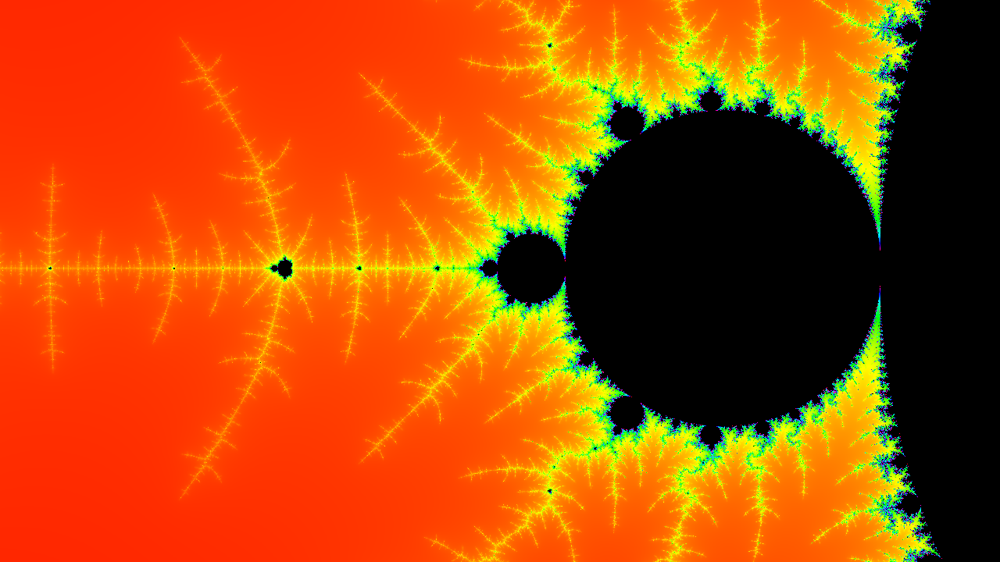
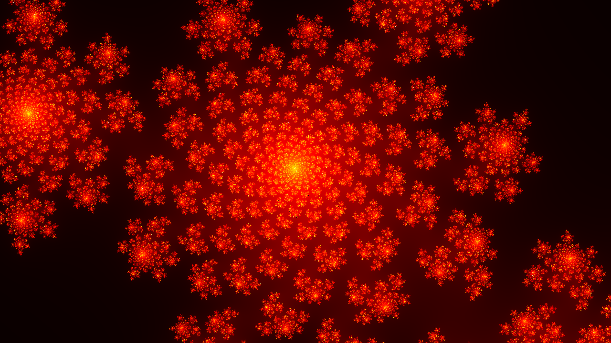
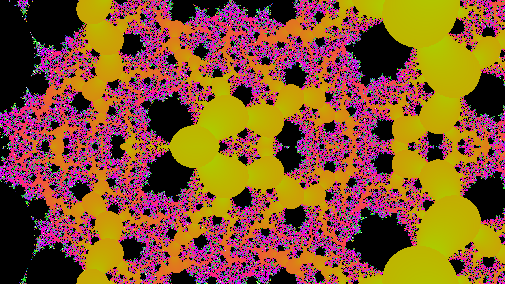
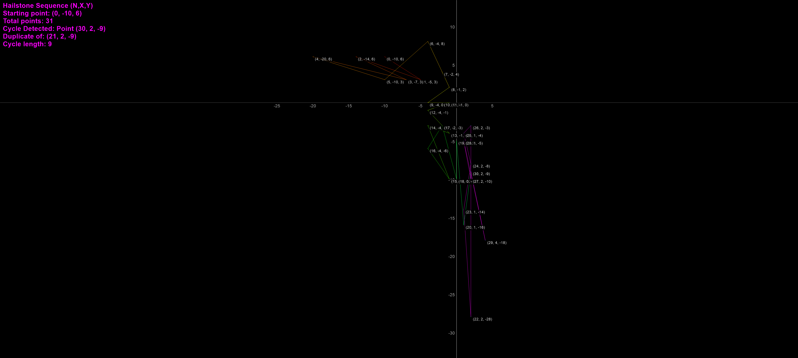

# ManpLab - Modern Fractal Explorer - Release 1.0 (Educational Fork)


**A modern WinUI 3 fractal explorer powered by Paul de Leeuw's production-grade rendering engine**

## 🚀 Overview

ManpLab combines a modern, intuitive WinUI 3 interface with Paul de Leeuw's exceptional fractal rendering engine - featuring perturbation theory, BLA acceleration, and arbitrary-precision arithmetic for extreme deep zoom capabilities (magnification > 10^100).

### Key Features

- ✨ **Modern WinUI 3 Interface** - Clean, responsive UI with MVVM architecture
- 🎨 **316 Fractal Types** - Extended from Paul's 246 originals with 70 new implementations ([See complete list →](#appendix-complete-fractal-catalog))
- 🔬 **Deep Zoom Technology** - Perturbation theory with magnifications exceeding 10^100
- ⚡ **BLA Acceleration** - Series approximation for extreme performance at deep zoom levels
- 🧮 **Arbitrary Precision** - MPFR, QD, and DD libraries for numerical accuracy
- 🎬 **Animation Rendering** - Create MP4 videos with FFmpeg integration
- 📚 **Fractal Browser** - Metadata, formulas, bookmarks, navigation history
- 🎨 **Theme System** - Light, Dark, Ocean Blue, and System themes
- 🖱️ **Interactive Exploration** - Mouse, keyboard, and touch navigation
- 💾 **Rich Image Metadata** - PNG/JPEG exports embed complete fractal parameters ([View metadata guide →](../docs/ImageMetadataGuide.md))
- ⌨️ [Full Keyboard Shortcuts](ManpWinUI/KEYBOARD_SHORTCUTS.md)

🔗 **[Get Started with ManpWinUI →](ManpWinUI/README.md)**

### Architecture

```
┌─────────────────────────────────────────┐
│   ManpWinUI (WinUI 3 / .NET 10)        │
│   Modern UI, MVVM, Theme System         │
└──────────────────┬──────────────────────┘
                   │
┌──────────────────▼──────────────────────┐
│   Native C++ Fractal Engine             │
│   (Paul de Leeuw's Production Engine)   │
│   • Perturbation Theory                 │
│   • BLA Acceleration                    │
│   • Arbitrary Precision (MPFR/QD)       │
│   • 246 Original Fractal Types          │
│   • Extended to 316 Types in ManpLab    │
│   • Multithreaded Rendering             │
└─────────────────────────────────────────┘
```

This educational fork makes Paul's sophisticated rendering technology accessible through a modern, user-friendly interface designed for students, educators, and researchers.

---


## Screenshots



*Mandelbrot Set rendered in the Spectrum palette*




*Classic Julia Set rendered in the Fire palette*




*Zoomed Tetrate rendered in the Psychedelic palette*




*2-Dimensional Hailstone Sequence with segments and point labels*


---

## Quick Start

### Pre-built Distributions

[](https://github.com/markhassellsmith/ManpLab/releases/latest)

**[Download Latest Release →](https://github.com/markhassellsmith/ManpLab/releases/latest)**

#### Portable ZIP (Recommended) ✅
- **No installation** - extract and run `ManpWinUI.exe`
- **No security warnings** - runs immediately
- **Self-contained** - includes all dependencies
- **Perfect for**: Educational use, quick testing, no admin rights needed

#### MSIX Package (Alternative)
- **Modern Windows app** - clean install/uninstall via Settings
- **⚠️ Shows security warning** - unsigned package (normal for open-source)
- See installation guide included in the download
- **Best for**: Users preferring managed apps with auto-update support

### Build from Source

```bash
git clone https://github.com/markhassellsmith/ManpLab.git
cd ManpLab
# Open ManpLab.sln in Visual Studio 2022 and build (F5)
```

All dependencies are included. The project builds without additional configuration.

**Requirements:**
- Windows 10 or 11 (x64)
- Visual Studio 2022 (Community Edition supported)
- .NET 10 SDK
- Git (for cloning)

---

## Educational Applications

ManpLab serves as a comprehensive platform for studying fractals, numerical methods, and computational mathematics across multiple disciplines, combining modern software engineering with advanced mathematical algorithms.

### Mathematics

**Complex Dynamics & Numerical Analysis:**
- 300 fractal types (246 from Paul de Leeuw, 54 new implementations): Mandelbrot, Julia sets, Newton fractals, exotic variants
- Perturbation theory for studying chaotic systems at extreme scales
- Deep zoom with magnifications exceeding 10^100
- Arbitrary-precision arithmetic (MPFR, QD, DD libraries)
- Numerical stability demonstrations and precision management

**Advanced Algorithms:**
- BLA (Bilinear Approximation) series approximation
- Perturbation algorithm with reference orbits
- Newton-Raphson root finding for fractal boundaries
- Analytical derivative calculations for distance estimation

### Computer Science

**Modern Software Architecture:**
- WinUI 3 application with MVVM pattern
- C++/WinRT native-managed interop
- Large-scale C++ engine (156 source files, 6 CMake subprojects)
- Template metaprogramming with generic numeric types
- Service-oriented architecture with dependency injection

**Performance Engineering:**
- Multithreaded rendering engine (utilizes all CPU cores)
- Cache optimization techniques
- Memory management with smart pointers
- Vectorization-ready code structure
- Progressive rendering with cancellation support

### Physics & Engineering

**Applications Across Disciplines:**
- **Electrical:** Chua's circuit, fractal antennas, chaos-based encryption
- **Mechanical:** Turbulent flow, nonlinear oscillators, fracture mechanics
- **General:** Strange attractors (Lorenz, Rössler, Hénon), bifurcation analysis, orbit traps, Lyapunov exponents

---

## Technical Features

### Native C++ Rendering Engine (Paul de Leeuw's Implementation)

#### Deep Zoom Technology
- Perturbation theory for efficient extreme magnification
- BLA series expansion to skip hundreds of iterations
- Arbitrary precision (MPFR) up to thousands of decimal places
- FloatExp extended exponent range for ultra-deep zooms
- Automatic precision scaling based on zoom level

#### Rendering Capabilities
- Multiple render modes: escape-time, slope/derivative shading, distance estimation
- Potential field, orbit trap, and biomorph coloring
- 24-bit true color with smooth gradients
- Bump mapping and animated color cycling
- Fractint .map palette support

#### Performance Optimizations
- Multithreaded engine utilizing all CPU cores
- Solid guessing and boundary tracing algorithms
- Progressive rendering with cancellation
- Dynamic task distribution
- Memory-mapped file support for large datasets

#### Formula System
- Custom scripting language for fractal definitions
- Virtual machine bytecode execution
- 100+ built-in mathematical functions
- Fractint formula compatibility

### Modern WinUI 3 Interface

- Responsive, touch-friendly design
- MVVM architecture with data binding
- Theme support (Light, Dark, Ocean Blue, System)
- Real-time parameter updates
- Fractal metadata browser with favorites
- Animation timeline editor
- Keyboard shortcuts for power users

#### Image Export with Embedded Metadata

ManpLab embeds comprehensive metadata into every exported PNG and JPEG image, enabling:
- **Exact reproduction** of any fractal render from saved files
- **Sharing parameters** without manual copying
- **Archival preservation** of exploration history
- **Open-source attribution** with automatic GitHub links

**📖 [Complete Image Metadata Guide →](../docs/ImageMetadataGuide.md)**

Metadata includes fractal family, mathematical parameters (center, zoom, iterations), rendering details (color palette, render time), and a full JSON blob for programmatic access. View metadata using ExifTool, XnView, or standard image properties in Windows/macOS.

---

## Fractal Categories

ManpLab features **316 unique fractals** across **42 specialized categories**, from classic mathematical sets to cutting-edge physical simulations. [View complete catalog →](#appendix-complete-fractal-catalog)

**Classic Fractals (30+):** Mandelbrot variants, Julia sets, Burning Ship, Newton fractals, Magnet fractals, Barnsley systems

**Mathematical Functions (50+):** Trigonometric, exponential, logarithmic, elliptic functions, special functions (Gamma, Bessel, Lambert W), polynomial variants

**Scientific Systems (35+):** Strange attractors (Lorenz, Rössler, Hénon, Chua), bifurcation diagrams, Lyapunov fractals, reaction-diffusion systems

**Engineering Applications (10+):** Chemical kinetics, mechanical stress/strain, heat transfer, electrical circuits, control systems

**Geometric & IFS (15+):** Sierpinski, Apollonius, Pascal triangle, Barnsley fern, fractal trees

**Orbit Traps & Advanced Coloring (20+):** Circular, cross, triangle traps, stripe averaging, curvature tracking, angle accumulation

**Artistic & Experimental (25+):** Buddhabrot, Biomorphs, Popcorn, Hopalong, Pickover Stalks, Celtic variations

**Research & Hybrid Fractals (20+):** Perturbation-optimized, bifurcation hybrids, mutant Mandelbrot, rational maps

---

## Project Structure

```
ManpLab/
├── ManpWinUI/              # WinUI 3 application (.NET 10)
│   ├── ViewModels/         # MVVM view models
│   ├── Views/              # XAML pages and controls
│   ├── Services/           # Business logic layer
│   └── Documentation/      # Comprehensive project docs
│
├── ManpCore.Services/      # Shared .NET services
│   └── FractalEngineWrapper.cs
│
├── ManpCore.Native/        # C++/WinRT interop layer
│   └── FractalEngineWrapper.cpp/.h
│
├── ManpWIN64/              # Native C++ rendering engine (156 files)
│   ├── Perturbation.cpp    # Perturbation algorithm
│   ├── Approximation.cpp   # BLA acceleration
│   ├── Slope.cpp           # Derivative shading
│   ├── BigComplex.cpp      # Arbitrary-precision complex
│   ├── Pixel.cpp           # Standard iteration engine
│   └── ...
│
├── parser/                 # Formula parser & VM (21 files)
├── qdlib/                  # Quad-double arithmetic
├── pnglib/                 # PNG export
├── ZLib/                   # Compression
└── external/               # MPFR, GMP, FFmpeg libraries
```

### Key Source Categories (Native Engine)

**Core Rendering:** `Pixel.cpp`, `BigPixel.cpp`, `Perturbation.cpp`, `PertEngine.cpp`

**Precision Types:** `Complex.cpp`, `BigComplex.cpp`, `DDComplex.cpp`, `QDComplex.cpp`, `ExpComplex.cpp`

**Algorithms:** `Approximation.cpp`, `Slope.cpp`, `FwdDiff.cpp`, `MandelDerivatives.cpp`

**Fractals:** `FractintFunctions.cpp`, `TierazonFunctions.cpp`, `Miscfrac.cpp`, `Bif.cpp`

**Color:** `Colour.cpp`, `Colour1.cpp`, `ColourMethod.cpp`, `TrueCol.cpp`

---

## Student Project Ideas

### Beginner (1-2 weeks)
1. Add custom color palettes
2. Implement parameter presets
3. Create keyboard shortcuts
4. Implement simple fractal variants

### Intermediate (4-8 weeks)
5. Histogram-based coloring
6. Progressive rendering preview
7. Parameter animation system
8. Undo/redo navigation
9. New escape-time fractals
10. Distance estimation rendering
11. Statistical analysis tools
12. 3D lighting and shadows

### Advanced (8-16 weeks)
13. GPU acceleration (CUDA/OpenCL)
14. Distributed rendering
15. SIMD optimization (AVX2/AVX-512)
16. Adaptive precision management
17. Automatic differentiation
18. Fractal dimension calculator
19. Plugin architecture
20. Cross-platform port (Linux/Mac)

### Research-Level
21. Novel series approximation methods
22. Machine learning for exploration
23. Perturbation theory for complex formulas
24. Real-time deep zoom interaction

---

## Build Instructions

### Visual Studio (Recommended)

1. Install Visual Studio 2022 with:
   - "Desktop development with C++" workload
   - ".NET desktop development" workload
   - .NET 10 SDK
2. Clone repository: `git clone https://github.com/markhassellsmith/ManpLab.git`
3. Open `ManpLab.sln`
4. Build (F5) - ManpWinUI will be set as startup project

### Command Line

```bash
git clone https://github.com/markhassellsmith/ManpLab.git
cd ManpLab
# Build native engine
cmake -B build -G "Visual Studio 17 2022" -A x64
cmake --build build --config Release
# Build WinUI app
dotnet build ManpWinUI/ManpWinUI.csproj -c Release
```

---

## Troubleshooting

**Build Issues:**
- Ensure C++ and .NET workloads are installed
- Verify .NET 10 SDK is present
- Clean and rebuild if linker errors occur
- Check that all NuGet packages restore successfully

**Runtime Issues:**
- Use Release build for production (Debug is significantly slower)
- Ensure native dependencies (MPFR, GMP) are in output directory
- Check Windows 10/11 is up to date for WinUI 3 support

**Performance:**
- Deep zoom automatically enables BLA and perturbation theory
- Reduce max iterations for initial exploration
- Multithreading is automatic (uses all CPU cores)
- Use "Progressive rendering" for interactive feedback

---

## Technology Stack

**Frontend:** .NET 10, WinUI 3, C#, XAML, MVVM Toolkit

**Native Engine:** C++17, Win32 API, CMake 3.23+

**Mathematical Libraries:** MPFR 4.2.2, GMP 6.3.0, QD Library, DD Arithmetic

**Media:** FFmpeg (animation export), libpng, ZLib

---

## Learning Resources

**Books:**
- Mandelbrot, *The Fractal Geometry of Nature*
- Peitgen et al., *Chaos and Fractals*
- Pickover, *Computers, Pattern, Chaos and Beauty*

**Online:**
- [FractalForums.org](https://fractalforums.org/)
- [Kalles Fraktaler](https://github.com/knighty/kf)
- [Inigo Quilez - Distance Estimation](https://iquilezles.org/articles/distancefractals/)

**Papers:**
- Hart, "Distance Estimation for Fractals"
- Claude Heiland-Allen, perturbation theory articles
- Lorenz (1963), "Deterministic Nonperiodic Flow"

---

## Contributing

Contributions are welcome from students, educators, and researchers.

**Guidelines:**
- Test Debug and Release builds
- Keep dependencies in `external/` directory
- Follow existing code style
- Document significant changes
- Maintain backward compatibility

**Development Workflow:**
1. Fork repository
2. Create feature branch
3. Make changes and test
4. Submit pull request with description

**Priority Areas:**
- GPU acceleration, additional fractals, performance optimizations
- Documentation, tutorials, unit tests
- Novel algorithms, research contributions

---

## Credits

**Paul de Leeuw (Paul the LionHeart)** - Native rendering engine with perturbation theory, BLA acceleration, and 246 original fractal implementations

**Mark Hassell Smith** - Modern WinUI 3 interface, MVVM architecture, 54 new fractals, metadata system, and educational materials

**GitHub Copilot** - Development assistance and documentation support

Special thanks to the fractal community at FractalForums.org for continued inspiration and technical contributions.

---

## License

MIT License - See LICENSE file for details.

This project includes third-party libraries with their own licenses (MPFR, GMP, libpng, ZLib).

---

## Version History

**v1.0 (2026)** - Educational fork release
- Modern WinUI 3 interface with MVVM architecture
- Complete integration of Paul de Leeuw's native engine
- Extended from 246 to 316 fractal types (70 new implementations)
- Comprehensive fractal metadata system
- Animation rendering with FFmpeg
- Theme system and accessibility features
- Comprehensive documentation
- Self-contained dependency management

**Original ManpWIN** - Paul de Leeuw (multiple versions 1990s-2010s)
- Deep zoom with perturbation theory
- BLA acceleration algorithms
- Formula parser and 246 fractal implementations
- Arbitrary-precision arithmetic integration

---

## Appendix: Complete Fractal Catalog

ManpLab includes **316 unique fractals** organized into 42 categories. This comprehensive catalog spans classic mathematical fractals, strange attractors, physical systems, and experimental variations.

### 3D Attractors (8)

- Aizawa Attractor
- Arneodo Attractor
- Chen-Lee Attractor
- Chua's Circuit
- Gingerbread Man
- Hénon Attractor
- Lorenz Attractor
- Rössler Attractor

### Barnsley Fractals (7)

- Barnsley Fern (IFS)
- Barnsley J1
- Barnsley J2
- Barnsley J3
- Barnsley M1
- Barnsley M2
- Barnsley M3

### Bifurcation Diagrams (4)

- Bifurcation Diagram
- Bifurcation-Mandel Hybrid
- Mandelbrot Parameter Space
- Mandelbrot-Lambda Space

### Burning Ship Variants (8)

- Bird of Prey
- Buffalo Burning Ship
- Burning Mandel Hybrid
- Burning Ship
- Burning Ship³ (Cubic)
- Burning Ship⁴ (Quartic)
- Celtic Burning Hybrid
- Celtic Burning Ship

### Chemical Engineering (4)

- Arrhenius Kinetics (Thermal Activation)
- Cahn-Hilliard Phase Separation
- Gray-Scott Reaction-Diffusion
- Langmuir-Hinshelwood Surface Catalysis

### Classical Polynomials (3)

- Chebyshev Polynomial
- Hermite Polynomial
- Legendre Polynomial

### Classic Escape-Time (8)

- Lambda Fractal
- Magnet I
- Magnet II
- Manowar
- Sierpinski
- Spider
- Tetrate
- Unity

### Complex Functions (8)

- Exponential Power
- Log Power
- Power Exponential
- Sinh Sinh
- Square Root Trig
- Trig Power
- Trig Square Root
- Trig Trig

### Distance Estimation (4)

- Burning Ship DEM
- Distance Estimation (Standard)
- Julia Set DEM
- Tricorn DEM

### Discrete Mathematics (3)

- Chebyshev Polynomial
- Combinatorial Mandelbrot
- Inverse Combinatorial

### Elliptic Functions (4)

- Jacobi Elliptic sn
- Weierstrass ℘-function
- Weierstrass ζ-function
- Weierstrass σ-function

### Exotic Fractals (8)

- Buffalo Mandelbrot
- Celtic Mandelbrot
- Heart Mandelbrot
- Mandelbar
- Perpendicular Buffalo
- Perpendicular Celtic
- Perpendicular Mandelbrot
- Zubieta Fractal

### Exponential & Logarithmic (10)

- Complex Power
- Exp-Mandel
- Exponential Julia
- Exponential Mandelbrot
- Exp² Mandelbrot
- Generalized Complex Power
- Log-Julia
- Logarithmic Mandelbrot
- Power Tower (Tetration)
- Zubieta Exponential

### Fractal Hybrids (8)

- Bifurcation-Mandel
- Burning-Mandel
- Celtic Hybrid
- Exp-Mandel
- Mutant Mandelbrot
- Perturbed Newton-Mandel
- Sierpinski-Mandel
- Trig-Blend

### Historical Fractals (8)

- Biomorphs
- Chip Map
- Collatz Fractal
- Duffing Map
- Martin Map
- Pickover Stalks
- Quaternion Julia (2D Slice)
- Sinusoidal Fractal

### IFS Fractals (5)

- Apollonius Gasket
- Barnsley Fern (IFS)
- Pascal Triangle Fractal
- Sierpinski Carpet (IFS)
- Sierpinski Triangle (IFS)

### Iterative Maps (8)

- Gingerbreadman Map
- Hopalong Attractor
- Icon Map
- Ikeda Map
- Martin Map
- Popcorn
- Sprott Map
- Symmetric Icon Map

### Julia Presets (23)

- Julia - Airplane
- Julia - Backbone
- Julia - Cauliflower
- Julia - Crystal
- Julia - Dendrite
- Julia - Double Spiral
- Julia - Dragon
- Julia - Eye of God
- Julia - Feigenbaum
- Julia - Flower
- Julia - Fractal Tree
- Julia - Fuzzy Blob
- Julia - Galaxy
- Julia - Golden Ratio
- Julia - Heart
- Julia - Lightning
- Julia - Medusa
- Julia - Neurons
- Julia - Paisley
- Julia - San Marco
- Julia - Siegel Disk
- Julia - Siegel Disk (Alt)
- Julia - Sine
- Julia - Spiral

### Lambda Fractals (8)

- Lambda Flip
- Lambda Modified
- Lambda Phoenix
- Lambda Power 3
- Lambda Power 4
- Lambda Squared
- Lambda Tan
- Lambda Tanh

### Magnet Fractals (4)

- Magnet I Cubic
- Magnet I Julia
- Magnet II Cubic
- Magnet II Julia

### Mandelbrot Variants (27)

- Burning Ship
- Celtic Buffalo
- Celtic Heart
- Heart Mandelbrot (Sine)
- Julia Power 4
- Mandelbar
- Mandelbar (Conjugate)
- Mandelbrot Power 4
- Mandelbrot-Lambda
- Manowar
- Marks Julia
- Marks Mandelbrot
- Marks Mandelbrot (Classic)
- Multibrot (Power 6)
- Multibrot (Power 7)
- Multibrot (Power 8)
- Multibrot⁴ (Quartic)
- Multibrot⁵ (Quintic)
- Multibrot³ (Cubic)
- Perpendicular Mandelbrot (Abs First)
- Shark Fin Mandelbrot
- Spider
- Spider Variant
- Thorn
- Thorn (Classic)
- Tricorn (Mandelbar)
- Wavy Mandelbrot

### Mechanical Engineering (5)

- Basquin Fatigue Power Law (S-N Curve)
- Euler-Bernoulli Buckling (Beam Deflection)
- Ramberg-Osgood Plastic Deformation (Malleability)
- Stefan-Boltzmann Radiative Cooling (Heat Flow)
- Torsional Twist (Angle of Twist)

### Multibrot Powers (8)

- Buffalo (Polynomial)
- Multibrot-10 (Decic)
- Multibrot-3 (Cubic)
- Multibrot-4 (Quartic)
- Multibrot-5 (Quintic)
- Multibrot-6 (Sextic)
- Multibrot-8 (Octic)
- Tricorn (Polynomial)

### Newton's Method (8)

- Newton (z³-1)
- Newton Basin (z³-1)
- Newton Cosh
- Newton Quartic (z⁴-1)
- Newton Quintic (z⁵-1)
- Newton Sextic (z⁶-1)
- Newton Sine
- Nova

### Orbit Statistics (4)

- Angle Average
- Average Distance
- Maximum Distance
- Minimum Distance

### Orbit Trap (4)

- Orbit Trap (Circle)
- Orbit Trap (Cross)
- Orbit Trap (Point)
- Orbit Trap (Square)

### Orbital Advanced (10)

- Circular Orbit Trap
- Cross Orbit Trap
- Delta Magnitude Tracking
- Orbit Angle Accumulation
- Orbital Curvature Tracking
- Point-Line Orbit Trap
- Smoothed Orbit (Running Average)
- Stalks (Conditional)
- Stripe Average Coloring
- Triangle Orbit Trap

### Phoenix Fractals (8)

- Phoenix Complex Feedback
- Phoenix Cosh
- Phoenix Cubic
- Phoenix Julia
- Phoenix Lambda
- Phoenix Mandelbrot
- Phoenix Quartic
- Phoenix Sine

### Polynomial Variants (8)

- Biomorph
- Cubic Mandelbrot
- Polynomial z⁴+z³+c
- Polynomial z³-z+c
- Quartic Mandelbrot
- Quintic Mandelbrot
- Rational R1
- Sextic Mandelbrot

### Rational Function Fractals (8)

- Halley's Method z³-1
- Möbius Fractal
- Newton z⁴-1
- Newton z⁵-1
- Newton z³-1
- Rational (z²+c)/(z²-c)
- Rational z²/(z³+c)
- Rational z³/(z³+c)

### Special (6)

- 2-D Hailstone Trajectory
- Buddhabrot
- Hailstone Sequence
- Lyapunov
- NumFractal
- Tetration (Classic)

### Special Function Fractals (15)

- Bessel-like Oscillatory
- Bose-Einstein Distribution
- Continued Fraction Fractal
- Damped Harmonic Oscillator
- Digamma Function ψ(z)
- Error Function (erf) Fractal
- Fermi-Dirac Distribution
- Gamma Function Fractal
- Hyperbolic Combination
- Lambert W Function
- Planck Distribution
- RLC Circuit Resonance
- Root Locus (Control Systems)
- Tetration (Power Tower)
- Trigamma Function ψ'(z)

### Strange Attractors (6)

- Bedhead Attractor
- Clifford Attractor
- De Jong Attractor
- Duffing Attractor
- Svensson Attractor
- Tinkerbell Attractor

### Tricorn Family (2)

- Tricorn (Power 3)
- Tricorn (Power 4)

### Trigonometric (8)

- Cosecant Mandelbrot
- Cosh Mandelbrot
- Cotangent Mandelbrot
- Mandel Trig
- Secant Mandelbrot
- Sech Mandelbrot
- Sinh Mandelbrot
- Tanh Mandelbrot

### Trigonometric Fractals (12)

- Cos(z) + c
- Lambda Lambda Cosh
- Lambda Lambda Cosine
- Lambda Lambda Sine
- Lambda Lambda Sinh
- Lambda Mandel Cosh
- Lambda Mandel Cosine
- Lambda Mandel Sine
- Lambda Mandel Sinh
- Mandelbrot Trig
- Sin(z) + c
- Sine Fractal

---

**Categories:** 42 families | **Total Fractals:** 316

*This catalog represents the current state of ManpLab v1.0, combining Paul de Leeuw's original 246 fractals with 70 new implementations spanning mathematical functions, physical systems, and experimental variations.*
