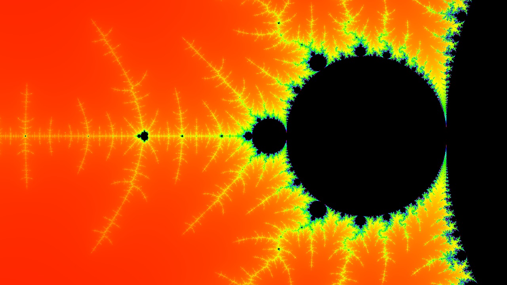
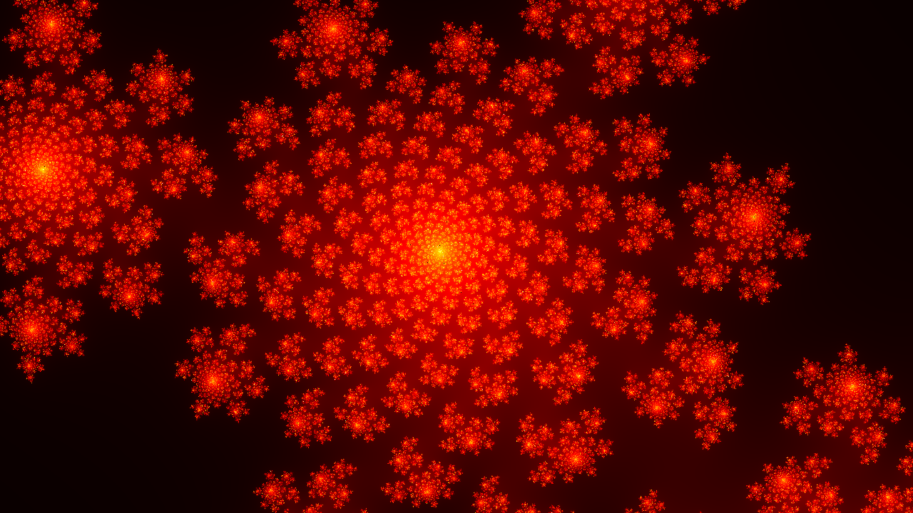
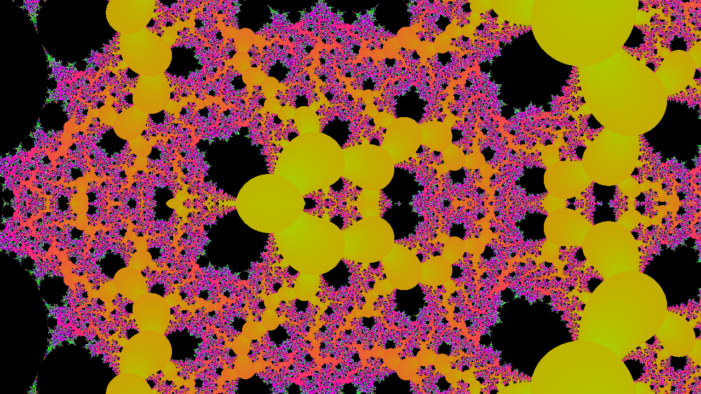
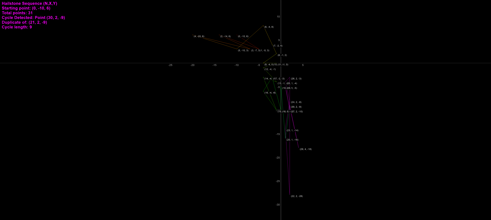

# ManpLab - Modern Fractal Explorer - Release 1.0 (Educational Fork)


**A modern WinUI 3 fractal explorer powered by Paul de Leeuw's production-grade rendering engine**

## 🚀 Overview

ManpLab combines a modern, intuitive WinUI 3 interface with Paul de Leeuw's exceptional fractal rendering engine - featuring perturbation theory, BLA acceleration, and arbitrary-precision arithmetic for extreme deep zoom capabilities (magnification > 10^100).

### Application Screenshot


*ManpLab Application Screenshot (above)*


### Key Features

- ✨ **Modern WinUI 3 Interface** - Clean, responsive UI with MVVM architecture
- 🎨 **300 Fractal Types** - Extended from Paul's 246 originals with 54 new implementations
- 🔬 **Deep Zoom Technology** - Perturbation theory with magnifications exceeding 10^100
- ⚡ **BLA Acceleration** - Series approximation for extreme performance at deep zoom levels
- 🧮 **Arbitrary Precision** - MPFR, QD, and DD libraries for numerical accuracy
- 🎬 **Animation Rendering** - Create MP4 videos with FFmpeg integration
- 📚 **Fractal Browser** - Metadata, formulas, bookmarks, navigation history
- 🎨 **Theme System** - Light, Dark, Ocean Blue, and System themes
- 🖱️ **Interactive Exploration** - Mouse, keyboard, and touch navigation
- ⌨️ [Full Keyboard Shortcuts](ManpWinUI/KEYBOARD_SHORTCUTS.md)

🔗 **[Get Started with ManpWinUI →](ManpWinUI/README.md)**

### Architecture

```
┌─────────────────────────────────────────┐
│   ManpWinUI (WinUI 3 / .NET 10)        │
│   Modern UI, MVVM, Theme System         │
└──────────────────┬──────────────────────┘
                   │
┌──────────────────▼──────────────────────┐
│   Native C++ Fractal Engine             │
│   (Paul de Leeuw's Production Engine)   │
│   • Perturbation Theory                 │
│   • BLA Acceleration                    │
│   • Arbitrary Precision (MPFR/QD)       │
│   • 246 Original Fractal Types          │
│   • Extended to 300 Types in ManpLab    │
│   • Multithreaded Rendering             │
└─────────────────────────────────────────┘
```

This educational fork makes Paul's sophisticated rendering technology accessible through a modern, user-friendly interface designed for students, educators, and researchers.

---


## Fractal Samples



*Mandelbrot Set rendered in the Spectrum palette (above)*




*Classic Julia Set rendered in the Fire palette (above)*




*Zoomed Tetrate rendered in the Psychedelic palette (above)*




*2-Dimensional Hailstone Sequence with segments and point labels (above)*


---

## Quick Start

### Pre-built Distributions

[](https://github.com/markhassellsmith/ManpLab/releases/latest)

**[Download Latest Release →](https://github.com/markhassellsmith/ManpLab/releases/latest)**

#### Portable ZIP (Recommended) ✅
- **No installation** - extract and run `ManpWinUI.exe`
- **No security warnings** - runs immediately
- **Self-contained** - includes all dependencies
- **Perfect for**: Educational use, quick testing, no admin rights needed

#### MSIX Package (Alternative)
- **Modern Windows app** - clean install/uninstall via Settings
- **⚠️ Shows security warning** - unsigned package (normal for open-source)
- See installation guide included in the download
- **Best for**: Users preferring managed apps with auto-update support

### Build from Source

```bash
git clone https://github.com/markhassellsmith/ManpLab.git
cd ManpLab
# Open ManpLab.sln in Visual Studio 2022 and build (F5)
```

All dependencies are included. The project builds without additional configuration.

**Requirements:**
- Windows 10 or 11 (x64)
- Visual Studio 2022 (Community Edition supported)
- .NET 10 SDK
- Git (for cloning)

---

## Educational Applications

ManpLab serves as a comprehensive platform for studying fractals, numerical methods, and computational mathematics across multiple disciplines, combining modern software engineering with advanced mathematical algorithms.

### Mathematics

**Complex Dynamics & Numerical Analysis:**
- 300 fractal types (246 from Paul de Leeuw, 54 new implementations): Mandelbrot, Julia sets, Newton fractals, exotic variants
- Perturbation theory for studying chaotic systems at extreme scales
- Deep zoom with magnifications exceeding 10^100
- Arbitrary-precision arithmetic (MPFR, QD, DD libraries)
- Numerical stability demonstrations and precision management

**Advanced Algorithms:**
- BLA (Bilinear Approximation) series approximation
- Perturbation algorithm with reference orbits
- Newton-Raphson root finding for fractal boundaries
- Analytical derivative calculations for distance estimation

### Computer Science

**Modern Software Architecture:**
- WinUI 3 application with MVVM pattern
- C++/WinRT native-managed interop
- Large-scale C++ engine (156 source files, 6 CMake subprojects)
- Template metaprogramming with generic numeric types
- Service-oriented architecture with dependency injection

**Performance Engineering:**
- Multithreaded rendering engine (utilizes all CPU cores)
- Cache optimization techniques
- Memory management with smart pointers
- Vectorization-ready code structure
- Progressive rendering with cancellation support

### Physics & Engineering

**Applications Across Disciplines:**
- **Electrical:** Chua's circuit, fractal antennas, chaos-based encryption
- **Mechanical:** Turbulent flow, nonlinear oscillators, fracture mechanics
- **General:** Strange attractors (Lorenz, Rössler, Hénon), bifurcation analysis, orbit traps, Lyapunov exponents

---

## Technical Features

### Native C++ Rendering Engine (Paul de Leeuw's Implementation)

#### Deep Zoom Technology
- Perturbation theory for efficient extreme magnification
- BLA series expansion to skip hundreds of iterations
- Arbitrary precision (MPFR) up to thousands of decimal places
- FloatExp extended exponent range for ultra-deep zooms
- Automatic precision scaling based on zoom level

#### Rendering Capabilities
- Multiple render modes: escape-time, slope/derivative shading, distance estimation
- Potential field, orbit trap, and biomorph coloring
- 24-bit true color with smooth gradients
- Bump mapping and animated color cycling
- Fractint .map palette support

#### Performance Optimizations
- Multithreaded engine utilizing all CPU cores
- Solid guessing and boundary tracing algorithms
- Progressive rendering with cancellation
- Dynamic task distribution
- Memory-mapped file support for large datasets

#### Formula System
- Custom scripting language for fractal definitions
- Virtual machine bytecode execution
- 100+ built-in mathematical functions
- Fractint formula compatibility

### Modern WinUI 3 Interface

- Responsive, touch-friendly design
- MVVM architecture with data binding
- Theme support (Light, Dark, Ocean Blue, System)
- Real-time parameter updates
- Fractal metadata browser with favorites
- Animation timeline editor
- Keyboard shortcuts for power users

---

## Fractal Categories (300 Types)

**Classic Fractals (20+):** Mandelbrot variants, Julia sets, Burning Ship, Newton fractals, Magnet fractals

**Advanced Variants (40+):** MandelDerivatives, Mandelbar/Tricorn, Spider, Thorn, Tetration, Power Towers

**Scientific Systems (30+):** Strange attractors (Lorenz, Rössler, Hénon, Pickover, Chua), bifurcation diagrams, Lyapunov fractals

**Hailstone Sequences:** 2D integer lattice dynamics with cycle detection, 5 transformation presets

**Geometric & IFS (20+):** Sierpinski, Apollonius, Pascal triangle, L-Systems, Barnsley fern

**Artistic Fractals (25+):** BuddhaBrot, Popcorn, Hopalong, Plasma, DLA, Langton's ant

**Tierazon Set (30+):** Phoenix, Hypercomplex, Froth, Icon/Icon3D, function compositions

**Research Fractals (15+):** Perturbation-optimized, polynomial, rational maps, Kleinian groups

**Custom:** User-defined formulas via scripting language

---

## Project Structure

```
ManpLab/
├── ManpWinUI/              # WinUI 3 application (.NET 10)
│   ├── ViewModels/         # MVVM view models
│   ├── Views/              # XAML pages and controls
│   ├── Services/           # Business logic layer
│   └── Documentation/      # Comprehensive project docs
│
├── ManpCore.Services/      # Shared .NET services
│   └── FractalEngineWrapper.cs
│
├── ManpCore.Native/        # C++/WinRT interop layer
│   └── FractalEngineWrapper.cpp/.h
│
├── ManpWIN64/              # Native C++ rendering engine (156 files)
│   ├── Perturbation.cpp    # Perturbation algorithm
│   ├── Approximation.cpp   # BLA acceleration
│   ├── Slope.cpp           # Derivative shading
│   ├── BigComplex.cpp      # Arbitrary-precision complex
│   ├── Pixel.cpp           # Standard iteration engine
│   └── ...
│
├── parser/                 # Formula parser & VM (21 files)
├── qdlib/                  # Quad-double arithmetic
├── pnglib/                 # PNG export
├── ZLib/                   # Compression
└── external/               # MPFR, GMP, FFmpeg libraries
```

### Key Source Categories (Native Engine)

**Core Rendering:** `Pixel.cpp`, `BigPixel.cpp`, `Perturbation.cpp`, `PertEngine.cpp`

**Precision Types:** `Complex.cpp`, `BigComplex.cpp`, `DDComplex.cpp`, `QDComplex.cpp`, `ExpComplex.cpp`

**Algorithms:** `Approximation.cpp`, `Slope.cpp`, `FwdDiff.cpp`, `MandelDerivatives.cpp`

**Fractals:** `FractintFunctions.cpp`, `TierazonFunctions.cpp`, `Miscfrac.cpp`, `Bif.cpp`

**Color:** `Colour.cpp`, `Colour1.cpp`, `ColourMethod.cpp`, `TrueCol.cpp`

---

## Student Project Ideas

### Beginner (1-2 weeks)
1. Add custom color palettes
2. Implement parameter presets
3. Create keyboard shortcuts
4. Implement simple fractal variants

### Intermediate (4-8 weeks)
5. Histogram-based coloring
6. Progressive rendering preview
7. Parameter animation system
8. Undo/redo navigation
9. New escape-time fractals
10. Distance estimation rendering
11. Statistical analysis tools
12. 3D lighting and shadows

### Advanced (8-16 weeks)
13. GPU acceleration (CUDA/OpenCL)
14. Distributed rendering
15. SIMD optimization (AVX2/AVX-512)
16. Adaptive precision management
17. Automatic differentiation
18. Fractal dimension calculator
19. Plugin architecture
20. Cross-platform port (Linux/Mac)

### Research-Level
21. Novel series approximation methods
22. Machine learning for exploration
23. Perturbation theory for complex formulas
24. Real-time deep zoom interaction

---

## Build Instructions

### Visual Studio (Recommended)

1. Install Visual Studio 2022 with:
   - "Desktop development with C++" workload
   - ".NET desktop development" workload
   - .NET 10 SDK
2. Clone repository: `git clone https://github.com/markhassellsmith/ManpLab.git`
3. Open `ManpLab.sln`
4. Build (F5) - ManpWinUI will be set as startup project

### Command Line

```bash
git clone https://github.com/markhassellsmith/ManpLab.git
cd ManpLab
# Build native engine
cmake -B build -G "Visual Studio 17 2022" -A x64
cmake --build build --config Release
# Build WinUI app
dotnet build ManpWinUI/ManpWinUI.csproj -c Release
```

---

## Troubleshooting

**Build Issues:**
- Ensure C++ and .NET workloads are installed
- Verify .NET 10 SDK is present
- Clean and rebuild if linker errors occur
- Check that all NuGet packages restore successfully

**Runtime Issues:**
- Use Release build for production (Debug is significantly slower)
- Ensure native dependencies (MPFR, GMP) are in output directory
- Check Windows 10/11 is up to date for WinUI 3 support

**Performance:**
- Deep zoom automatically enables BLA and perturbation theory
- Reduce max iterations for initial exploration
- Multithreading is automatic (uses all CPU cores)
- Use "Progressive rendering" for interactive feedback

---

## Technology Stack

**Frontend:** .NET 10, WinUI 3, C#, XAML, MVVM Toolkit

**Native Engine:** C++17, Win32 API, CMake 3.23+

**Mathematical Libraries:** MPFR 4.2.2, GMP 6.3.0, QD Library, DD Arithmetic

**Media:** FFmpeg (animation export), libpng, ZLib

---

## Learning Resources

**Books:**
- Mandelbrot, *The Fractal Geometry of Nature*
- Peitgen et al., *Chaos and Fractals*
- Pickover, *Computers, Pattern, Chaos and Beauty*

**Online:**
- [FractalForums.org](https://fractalforums.org/)
- [Kalles Fraktaler](https://github.com/knighty/kf)
- [Inigo Quilez - Distance Estimation](https://iquilezles.org/articles/distancefractals/)

**Papers:**
- Hart, "Distance Estimation for Fractals"
- Claude Heiland-Allen, perturbation theory articles
- Lorenz (1963), "Deterministic Nonperiodic Flow"

---

## Contributing

Contributions are welcome from students, educators, and researchers.

**Guidelines:**
- Test Debug and Release builds
- Keep dependencies in `external/` directory
- Follow existing code style
- Document significant changes
- Maintain backward compatibility

**Development Workflow:**
1. Fork repository
2. Create feature branch
3. Make changes and test
4. Submit pull request with description

**Priority Areas:**
- GPU acceleration, additional fractals, performance optimizations
- Documentation, tutorials, unit tests
- Novel algorithms, research contributions

---

## Credits

**Paul de Leeuw (Paul the LionHeart)** - Native rendering engine with perturbation theory, BLA acceleration, and 246 original fractal implementations

**Mark Hassell Smith** - Modern WinUI 3 interface, MVVM architecture, 54 new fractals, metadata system, and educational materials

**GitHub Copilot** - Development assistance and documentation support

Special thanks to the fractal community at FractalForums.org for continued inspiration and technical contributions.

---

## License

MIT License - See LICENSE file for details.

This project includes third-party libraries with their own licenses (MPFR, GMP, libpng, ZLib).

---

## Version History

**v1.0 (2026)** - Educational fork release
- Modern WinUI 3 interface with MVVM architecture
- Complete integration of Paul de Leeuw's native engine
- Extended from 246 to 300 fractal types (54 new implementations)
- Comprehensive fractal metadata system
- Animation rendering with FFmpeg
- Theme system and accessibility features
- Comprehensive documentation
- Self-contained dependency management

**Original ManpWIN** - Paul de Leeuw (multiple versions 1990s-2010s)
- Deep zoom with perturbation theory
- BLA acceleration algorithms
- Formula parser and 246 fractal implementations
- Arbitrary-precision arithmetic integration
